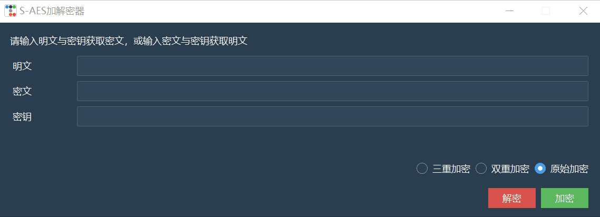

# 作业2：S-AES算法实现(测试结果)

## 第1关 基本测试

### -实验目标

​	根据S-AES算法编写和调试程序，提供GUI解密支持用户交互。输入可以是16bit的数据和16bit的密钥，输出是16bit的密文。

### -实验结果

1. 加密操作验证

   ​	随机输入一个明文（**P=1100100101000111**）和密钥（**K=0010110101010101**）

   

   ​	得到密文（**C=1010011001111101**）

2. 解密操作验证

   ​	输入第一步中加密得到的密文（**P=1010011001111101**）和密钥（**K=0010110101010101**）

   

​			得到与第一步相同的明文（**P=1100100101000111**)

## 第2关 交叉测试

### -实验目标

​	考虑到是"**算法标准"**，所有人在编写程序的时候需要使用相同算法流程和转换单元(替换盒、列混淆矩阵等)，以保证算法和程序在异构的系统或平台上都可以正常运行。

​	设有A和B两组位同学(选择相同的密钥K)；则A、B组同学编写的程序对明文P进行加密得到相同的密文C；或者B组同学接收到A组程序加密的密文C，使用B组程序进行解密可得到与A相同的P。

### -实验结果

​	与DIO组进行了交叉测试

1. 输入同样的明文（**P=1100100101000111**）和密钥（K=**0010110101010101**），进行加密

   

   

2. 得到了同样的密文（**C=1010011001111101**）

## 第3关 扩展功能

### -实验目标

​	考虑到向实用性扩展，加密算法的数据输入可以是ASII编码字符串(分组为2 Bytes)，对应地输出也可以是ACII字符串(很可能是乱码)。

### -实验结果

1. 加密操作验证、

   ​	随机输入一个字符串（**P="Hello World"**）和密钥（**K=0010110101010101**）

   
   
   ​	得到密文（**C="渖ᴩ责责뫁퉌Ⅿ责ഢ"**）
   
 2. 解密操作验证

    ​	输入第一步中加密得到的字符串（**C="渖ᴩ责责뫁퉌Ⅿ责ഢ"**）和密钥（**K=0010110101010101**）

    

    ​	得到与第一步相同的明文（**P="Hello World"**）

## 第4关 多重加密

### 4.1 双重加密

#### -实验目标

​	将S-AES算法通过双重加密进行扩展，分组长度仍然是16 bits，但密钥长度为32 bits。

​	这里我们采用的**双重加解密方案**是
$$
C = E(K_{2},E(K_{1},P))
$$

$$
P = D(K_{1},D(K_{2},C))
$$

#### -实验结果

加密操作验证

​	随机输入一个明文（**P=1100100101000111**）和密钥（**K=10110101100100100011100100101110**）

​	得到密文（**C=1111010101111001**）

解密操作验证

​	输入第一步中加密得到的密文（**C=1111010101111001**）和密钥（**K=10110101100100100011100100101110**）

​	得到与第一步相同的明文（**P=1100100101000111**）

### 4.2 中间相遇攻击

#### -实验目标

​	假设你找到了使用相同密钥的明、密文对(一个或多个)，请尝试使用中间相遇攻击的方法找到正确的密钥Key(K1+K2)。

#### -实验结果

​	所有明密文对均使用相同的密钥（**K~1~=0010110101010101，K~2~=0101011010101001**），我们选择使用不同个数的明、密文对来进行相遇交叉攻击

1. 一个明密文对

   **P~1~=1100100101000111，C~1~=1001010011000101**

2. 两个明密文对

   **P~1~=1100100101000111，C~1~=1001010011000101**

   **P~2~=1110100010010111，C~2~=1011011110100110**

3. 三个明密文对

   **P~1~=1100100101000111，C~1~=1001010011000101**

   **P~2~=1110100010010111，C~2~=1011011110100110**

   **P~3~=0101101101100101，C~3~=0111110001000111**

4. 实验结果

   程序运行时间在一分钟左右，请耐心等待。

​		从实验结果可以得到，当只有**一个明、密文对**时，可以得到**65638**个符合要求的密钥；当有**两个明、密文**对时，可以得到**2**个符合要求的密钥；当有**三个明、密文**对时，只剩下**1**个符合要求的密钥，而该密钥正是我们使用的密钥。

### 4.3 三重加密

#### -实验目标

​	将S-AES算法通过三重加密进行扩展，下面两种模式选择一种完成：

​		(1)按照32 bits密钥Key(K1+K2)的模式进行三重加密解密，

​		(2)使用48bits(K1+K2+K3)的模式进行三重加解密。

​	这里我们采用的**三重加解密方案**是第二种模式
$$
C = E(K_{3},E(K_{2},E(K_{1},P)))
$$

$$
P = D(K_{3},D(K_{2},D(K_{1},C)))
$$

#### -实验结果

1. 加密操作验证

   ​	随机输入一个明文（**P=1100100101000111**）和密钥（**K=001011010101010110101000101001011010100110110101**）

   

   ​	得到密文（**C=1100101001010110**）

2. 解密操作验证

   ​	输入第一步中加密得到的密文（**C=1100101001010110**）和密钥（**K=001011010101010110101000101001011010100110110101**）

   

   ​	得到与第一步相同的明文（**P=1100100101000111**）

## 第5关 工作模式

### -实验目标

​	基于S-AES算法，使用密码分组链(CBC)模式对较长的明文消息进行加密。注意初始向量(16 bits) 的生成，并需要加解密双方共享。

​	在CBC模式下进行加密，并尝试对密文分组进行替换或修改，然后进行解密，请对比篡改密文前后的解密结果。

### -实验结果

 1. 基于CRC模式的长明文加密如第一块输出所示，其中

    长明文**P=0000000100100011010001010110011110001001101010111100110111101111**

    密钥**K=0010110101010101**

    初始向量C0为随机生成**C0=1100111011001010**

    加密后得到的密文**C=1110010011111000010010100001111111110100001011100101111110100000**

    解密后得到的明文**P=1110010011111000010010100001111111110100001011100101111110100000**

    可以看到基于CRC模式的长明文加解密结果是一致的。

 2. 将密文分组倒数第二分组中三个二进制位取反来对密文进行篡改

    篡改密文前: **P=0000000100100011010001010110011110001001101010111100110111101111**

    篡改密文后: **P=0000000100100011010001010110011100101001101001100010110111101111**

    可以看到解密得到的明文中第**32，34，44，45，47，48，49，50**位发生变化

    

