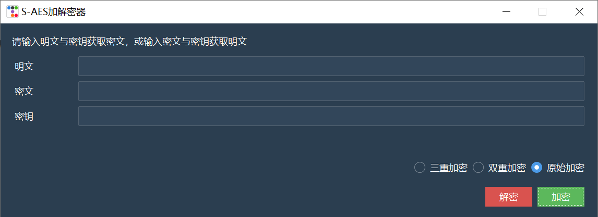
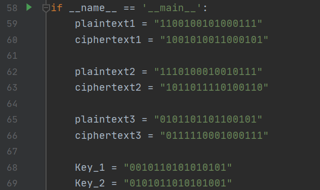

# 作业2：S-AES算法实现(用户指南)

## 文件目录

1. S_AES.py                  第1，2，3，4关的执行代码
1. S_DES_4.2.py          第4.2关的执行代码
1. S_DES_5.py             第5关的执行代码

## S_DES.py   

 	1. 使用任意支持python的IDE打开该文件
 	2. 执行该文件代码
 	3. GUI界面如下图



#### 多重加密

1. 点击右下角的单选框，选择需要**加、解密的轮数**。

#### 加密操作

1. 在明文对应输入框中输入任意明文字符串，可以是**16位二进制字符串**或者**任意长度字符串**

2. 在密钥对应输入框中输入任意密钥字符串

   原始加密必须是**16位二进制字符串**

   双重加密必须是**32位二进制字符串**

   三重加密必须是**48位二进制字符串**

3. 点击**加密**按钮即可获得加密结果，并且会将结果复制显示在密文框中

#### 解密操作

1. 在密文对应输入框中输入任意密文字符串，可以是**16位二进制字符串**或者**任意长度字符串**

2. 在密钥对应输入框中输入任意密钥字符串

   原始加密必须是**16位二进制字符串**

   双重加密必须是**32位二进制字符串**

   三重加密必须是**48位二进制字符串**

3. 点击**解密**按钮即可获得解密结果，并且会将结果复制显示在明文框中

## S_DES_4.2.py

```
  1. 使用任意支持python的IDE打开
  2. 直接运行程序即可
```



​	此处可以修改破解的密钥和已知的明、密文对

## S_DES_5.py

```
  1. 使用任意支持python的IDE打开
  2. 直接运行程序即可
```